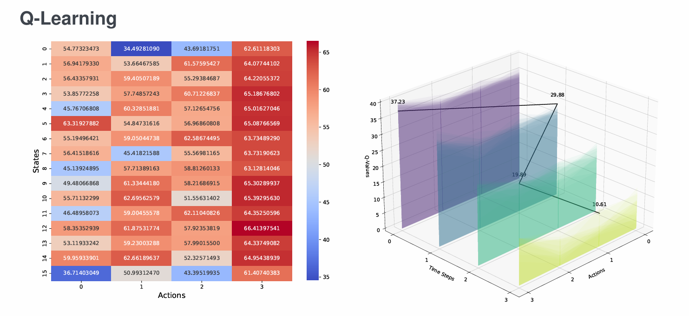
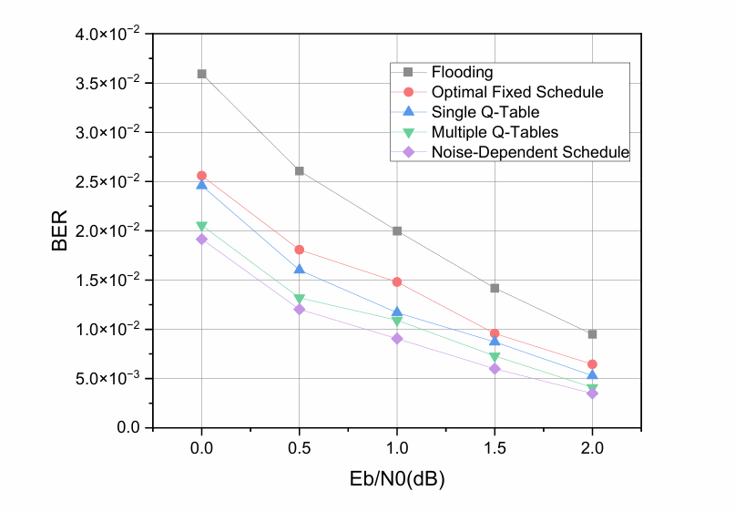

# Learning a Sequential BP Decoding Schedule for LDPC Codes using Reinforcement Learning

This is my research project at the **University of Stuttgart**, Institute of Telecommunications.

- **Author:** Yixuan Wu
- **Supervisors:** Daniel Tandler, Paul Bezner
- **Date:** 3 December 2024

## Overview

This project explores using **Q-Learning** to learn a sequential Belief-Propagation (BP) decoding schedule for LDPC codes, instead of relying on the standard Flooding or fixed Layered schedule.

The agent decides, at each step, **which check node (CN) to update next**, given the current state of the Tanner graph. The goal is to lower the bit-error rate (BER) over an AWGN channel with BPSK modulation.

### RL formulation
- **State:** binary soft syndrome of all check nodes (e.g. `0000`–`1111`)
- **Action:** index of the next CN to schedule
- **Reward:** maximum residual `r_a = max |m'_{a→j} − m_{a→j}|`
- **Update rule:** Bellman equation, `Q(s,a) ← (1−α)Q(s,a) + α(r + γ·max_a' Q(s',a'))`

### Schedules compared
- Flooding
- Optimal Fixed Schedule
- Single Q-Table
- Multiple Q-Tables (one per time step)
- Noise-Dependent Schedule

## Results

**Q-Learning convergence (Q-table heatmap & per-time-step Q-values):**

**BER vs. Eb/N0 — comparison of all schedules:**

The learned schedules (Single Q-Table, Multiple Q-Tables, Noise-Dependent) all outperform Flooding, and the Noise-Dependent schedule achieves the lowest BER across the tested SNR range.

## Reference

Habib, S., Beemer, A., Kliewer, J. (2021). *Belief propagation decoding of short graph-based channel codes via reinforcement learning.* IEEE Journal on Selected Areas in Information Theory, 2(2):627–640.
